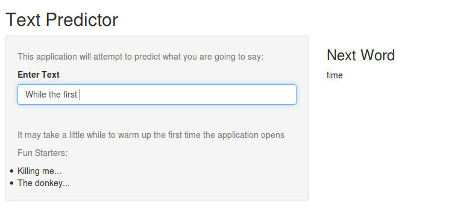

Data Science Capstone
========================================================
author: Nicholas Smith  
date: 22nd April 2016

Algorithm
========================================================

- Will first try to match a tri-gram with the users last two entered words - then predict the third 

- If no tri-gram is found back off to a bi-gram for the last word typed - then predict the second

- If still no suitable predication use the most common English word.

The App
========================================================

***
- Simply type you phrase into the box on the left hand side

- See the prediction in the centre.

- During processing the work will be pale then go black on completion.

Thoughts on Data
========================================================

Twitter data is very specialised 'Twinglish'
- Very different to other two data sets
- Disrupts valid predication with improper words

In future would not combine all three.
- Would use blog & news corpora for 'real' English prediction
- Different corpus for social media Twinglish / TxtSpeak

Further Refinement 
========================================================

Filtering of stop words
- Not currently catered for.
- Might be worth dropping them as they derail the prediction

Greater Sample Sizing
- Processing power limited me to using a sample size of about 3%

Dictionary Cross Reference
- Would filter out any samples without legitimate words

