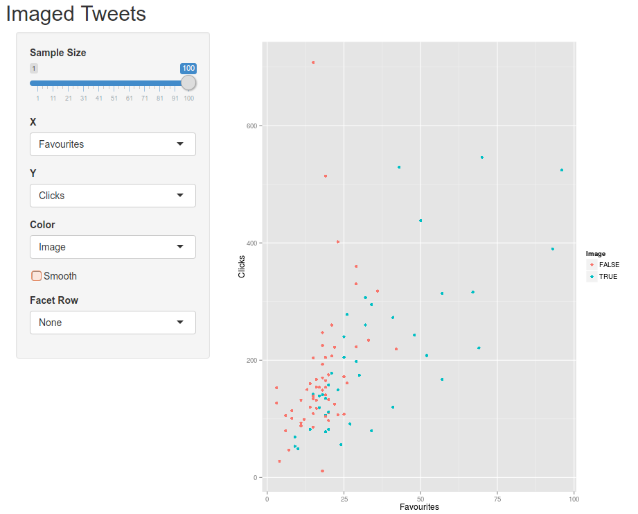

Imaged Tweets And Engagement
========================================================
author: Nicholas Smith
date: 19th November 2015 
transition: rotate

Overview
========================================================

This applciation allows you explore the amount of engagement recieved by tweets that either did or did not have an image posted with them.

You can: 

- Explore data by favourties, retweets, clicks
- Supports plotting on X,Y in addition to colour and an image only facet
- Add a smoothed mean line with confidence interval

The Application
========================================================


***
* Controls are on the left, sliders drops downs and a check boxes
* The main frame is presents the information in a ggplot

Reactive UI
========================================================
The application comes with slider that allows you to select the sample size up to the 100 total.  The interval for the slider is 5.  This is means there is a total of 20 different combinations of sample data to explore!

## Interesting Facts

The mean number of Retweets in the dataset is:

```
[1] 21.68
```
and the mean number of Favourites is:

```
[1] 24.32
```


References
========================================================

### Data 
The data used in the application can be found on this blog
https://blog.bufferapp.com/the-power-of-twitters-new-expanded-images-and-how-to-make-the-most-of-it

### Tutorial
Inspiration and basis for the UI and Server came from the diamonds example in Shiny tutorial
http://rstudio.github.io/shiny/tutorial/


