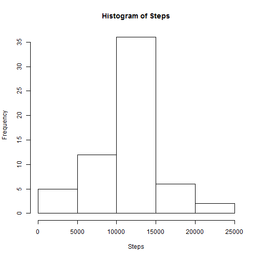
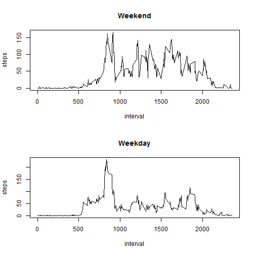

## Reproducable Research - Assignement 1 


### Loading and preprocessing the data

First load the data. As the data is in a zip file we use the `unz` function and then `read.csv`.  The default arguments are fine for both functions.


```r
data.raw <- read.csv(unz("activity.zip", "activity.csv"), stringsAsFactors=FALSE)
data.raw$date <- as.Date(data.raw$date)
```

### What is mean total number of steps taken per day?

Calculate the total number of steps per day.  Also tidy the column headings in the totals dataframe


```r
data.steps.by.date <- aggregate(x= data.raw['steps'], by=list(data.raw$date), FUN=sum, na.rm=TRUE)
colnames(data.steps.by.date) <- c("date", "steps")
```

Show a histogram of the total number of steps each day


```r
hist(data.steps.by.date$steps, main="Histogram of Steps", xlab = "Steps")
```

 

Show the `mean` and the `median` number of steps taken per day


```r
mean(data.steps.by.date$steps)
```

```
## [1] 9354.23
```

```r
median(data.steps.by.date$steps)
```

```
## [1] 10395
```

### What is the average daily activity pattern?


```r
data.steps.by.interval <- aggregate(steps ~ interval, data.raw, FUN=mean, na.rm=TRUE)
plot(data.steps.by.interval, type="l")
```

 

Show the5-minute interval, on average across all the days in the dataset, contains the maximum number of steps.
First order the by steps descending, using `order` and `rev`.  Then select the first interval.


```r
data.steps.by.interval.ordered <- data.steps.by.interval[rev(order(data.steps.by.interval$steps)),]
data.steps.by.interval.ordered[1,1]
```

```
## [1] 835
```

### Imputing missing values

Calculate and report the total number of missing values in the dataset. Using `sum` to count the number of times `is.na` returns true. 


```r
sum(is.na(data.raw$steps))
```

```
## [1] 2304
```

In order to populate the na's with more meaningfull data I will use the `mean` calculated from the five minute intervals calculated earlier. Also we will use `round` for an integer value.


```r
data.filled <- data.raw
nas <- as.numeric(rownames(data.filled[is.na(data.filled$steps), ]))

for(i in nas){
  data.filled[i, ]$steps <- 
    round(data.steps.by.interval[
      which(data.steps.by.interval$interval == data.filled[i,3]), ]$steps)     
}
```

Show that the new data set has no na values


```r
sum(is.na(data.filled$steps))
```

```
## [1] 0
```

Show a histogram of the total number of steps taken each day, with the filled dataset with no na values. Calculate the day values and tidy the headings like before.


```r
data.filled.steps.by.date <- aggregate(x= data.filled['steps'], by=list(data.raw$date), FUN=sum, na.rm=TRUE)
colnames(data.filled.steps.by.date) <- c("date", "steps")
hist(data.filled.steps.by.date$steps, main="Histogram of Steps", xlab = "Steps")
```

 

Show the `mean` & `median` for the new data set

```r
mean(data.filled.steps.by.date$steps)
```

```
## [1] 10765.64
```

```r
median(data.filled.steps.by.date$steps)
```

```
## [1] 10762
```

### Are there differences in activity patterns between weekdays and weekends?


```r
weekends <- which(weekdays(data.filled$date) %in% c("Saturday", "Sunday"))
data.filled$dayofweek <- "Weekday"
data.filled[weekends, "dayofweek"] <- "Weekend"
data.filled$dayType <- as.factor(data.filled$dayofweek)
summary(data.filled$dayType)
```

```
## Weekday Weekend 
##   12960    4608
```

Show a panel plot containing a time series plot for both weekends and weekdays


```r
data.weekend <- aggregate(steps ~ interval, subset(data.filled, data.filled$dayType == 
    "Weekend"), mean)
data.weekday <- aggregate(steps ~ interval, subset(data.filled, data.filled$dayType == 
    "Weekday"), mean)

par(mfrow=c(2,1))
plot(data.weekend, type = "l", main = "Weekend")
plot(data.weekday, type = "l", main = "Weekday")
```

 
